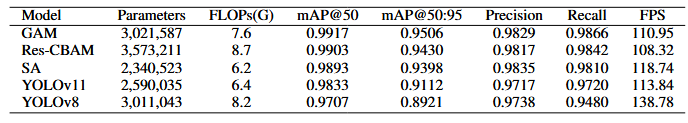
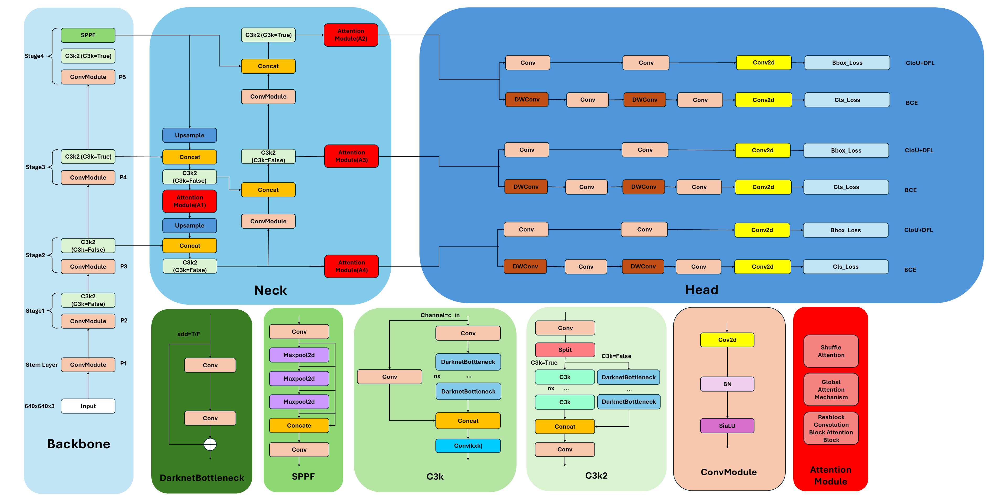

# YOLO-AMC
An Improved YOLO Architecture with Attention Mechanisms for Building Crack Detection

## Architecture Overview


## Performance



## Citation

If you find this work useful, please consider citing:

```bibtex
@article{tsai2026yoloamc,
  title={YOLO-AMC: An Improved YOLO Architecture with Attention Mechanisms for Building Crack Detection},
  author={Tsai, Ching-Yu},
  note={Manuscript in preparation},
  year={2026}
}
```

## Environment

pip install -r requirements.txt

## Methodology

YOLO-AMC integrates multiple attention mechanisms into the YOLO11 Neck architecture to enhance multi-scale feature representation for building crack detection.

The proposed architecture evaluates different attention modules, including:
- GAM
- Res-CBAM
- Shuffle Attention (SA)

Different attention insertion locations within the Neck are also investigated through ablation experiments.


